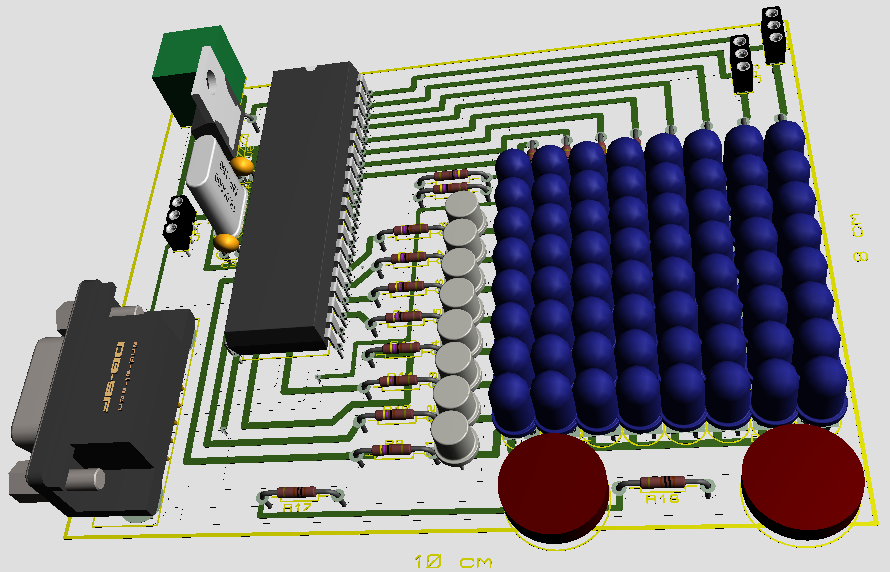

# zmija1997
The goal of this project was to realize the popular game of the of the last century - Snake 1997
on the selected PIC16F1939 microcontroller on an 8x8 custom lediode display fully from scratch.
The repository contains all other interesting files in the 'meta' folder.

